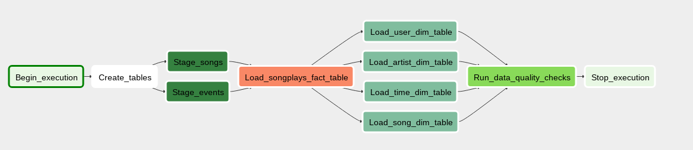

# Project: Data Pipelines with Airflow

## Description
This project implements a data pipeline for a music streaming startup called _Sparkify_, that has decided to introduce more automation and monitoring to their data warehouse pipelines using Apache Airflow. Their data resides in S3, in a directory of JSON logs on user activity on the app (`log_data`) as well as a directory with JSON metadata on the songs in their app (`song_data`). The pipeline extracts the data from S3, stages it on a data warehouse in Amazon Redshift, fill the dimensional schema from the staging tables and finally perform some data quality checks on the final tables.

## ELT Pipeline
The data pipeline implemented is well represented in the Airflow DAG:


## Structure
The relevant files are contained in the folder `airflow` with the following structure:
* `dags` : contains the file `sparkify_dag.py` with the Airflow DAG definition and the tasks creation and dependencies
* `data` : contains the two JSONPaths file `log_data_jsonpaths.json` and `song_data_jsonpaths.json` used to correctly format the JSON files of the dataset during the load to Redshift
* `plugins/helpers:` : contains a `sql_queries.py` script file, with the SQL queries definitions to perform the SELECT operations from the staging tables, to be used in combination with a INSERT INTO to fill the analytics tables. It contains also an additional script `upload_to_s3.py` that was used to upload to a S3 bucket the JSONPaths files 
* `plugins/operators`: contain the classes that define the operators for tables creation (`create_table.py`), to stage the dataset from S3 to Redshift (`stage_redshift.py`), to load fact and dimension tables (`load_fact.py` and `load_dimension.py`) and to simple data quality checks on the final tables (`data_quality.py`)
* `create_tables.sql` : SQL file containing the creation queries for staging and analytics tables.


## Airflow connections
To work with Airflow and Amazon AWS for this project is necessary to setup two connections (or two hooks), one to establish the connection through credentials with AWS, one other to access the Amazon Redshift cluster through its endpoint. 


## Further notes
To grant a correct processing when loading the JSON files from S3 to Redshift it was necessary to setup two JSONPaths files, one for `song_data` and one for `log_data`. These two files were uploaded onto a "helper" S3 bucket (e.g. `myawsbucket-dend`). The path to these files can be specified when instantiating the `StageToRedshift` custom operator, through the parameter `jsonpaths`, for example:

```
stage_task = StageToRedshiftOperator(
...,
jsonpaths="s3://<myawsbucket-dend>/log_data_jsonpaths.json"
)
```